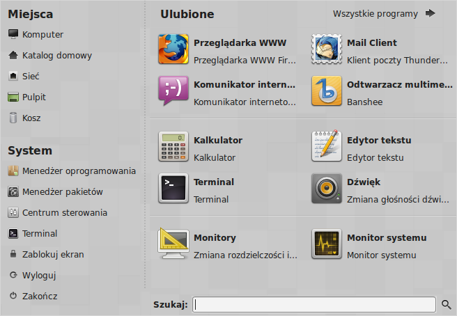
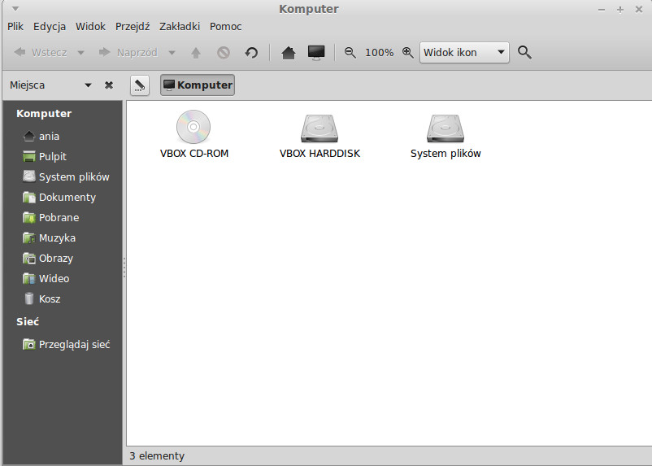
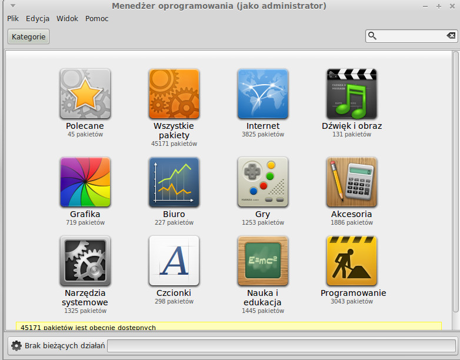
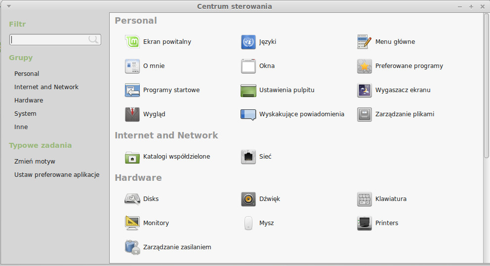
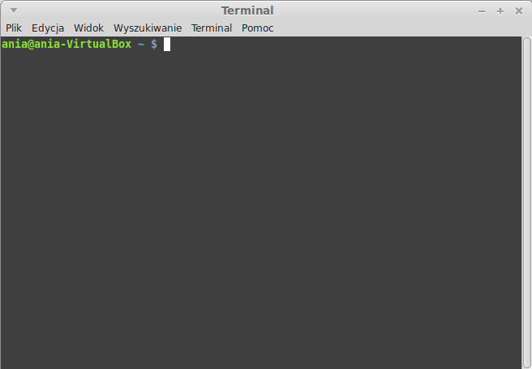
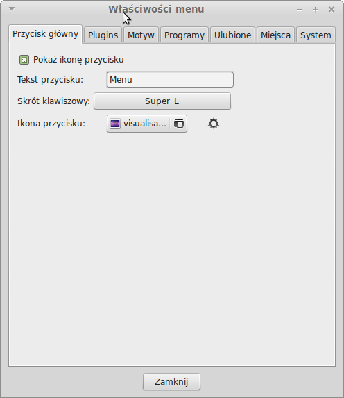

# Ustawienia pulpitu

Menu Linux Mint'a  jest unikalne. Początkowo było zainspirowane menu **Slab** stworzonym przez **SUSE**, ale różni się od niego pod wieloma względami.

Linux Mint zawiera także domyślne menu MATE, którym można zastąpić Menu Linux Mint'a, ale dowiesz się o tym w dalszej części. Menu Linux Mint'a jest warte poznania. Różni się bardzo od tego, którego używałeś do tej pory, jednakże powinno Ci się spodobać, kiedy już się do niego przyzwyczaisz.

Aby otworzyć menu kliknij **Menu** w lewym-dolnym rogu ekranu lub wciśnij kombinację klawiszy CTRL+SUPER_L (**Super_L** jest lewym klawiszem Windows na Twojej klawiaturze).

###Poznajemy menu

####Miejsca



W lewym-górnym rogu menu zobaczysz sekcję zwaną **Miejsca**, która dostarcza pięć przycisków. Pozwolą Ci one uzyskać szybki dostęp do najważniejszych miejsc Twojego pulpitu MATE.



**Komputer** pokazuje woluminy pamięci masowej komputera. Jeśli partycje są zamontowane a **Ustawienia Pulpitu** są ustawione aby pokazywać **Zamontowane urządzenia** na pulpicie to prawdopodobnie niezbyt często będziesz tu zaglądał. Jednakże, jeśli nie będziesz miał zaznaczonej tej opcji, lub jeśli będziesz chciał zamontować partycję, która nie jest domyślnie montowana, to opcja ta może okazać się bardzo pomocna.


Miejsce **Katalog domowy** jest jednym z przycisków menu, którego prawdopodobnie będziesz używał najczęściej. Jeśli używałeś MATE wcześniej to prawdopodobnie używałeś ikony  **Katalog domowy** zlokalizowanej na Pulpicie. Kiedy okna są pootwierane i pulpit nie jest widoczny, menu może okazać się przydatne zapewniając Ci dostęp do **Katalogu domowego**
* **Katalog domowy** istnieje po to aby dać Ci miejsce na trzymanie danych prywatnych
* Katalog Pulpit odpowiada temu co jest wyświetlane na pulpicie, więc umieszczenie pliku tutaj, również umieści go na Pulpicie. Ten sam efekt można osiągnąć, po prostu przeciągając plik na Pulpit.
* Miejsce **Sieć** po prostu pokaże Ci inne komputery, współdzielone usługi, domeny, grupy robocze obecne w sieci.
* **Kosz** to miejsce gdzie lądują pliki po skasowaniu


Po kliknięciu prawym klawiszem myszy na pliku można go **Przenieść do Kosza** lub **Wykasować**. Jeśli wybierzesz **Kasuj**, plik będzie permanentnie skasowany i nie będziesz w stanie go odzyskać. Jeśli wybierzesz **Przenieś do kosza**, zostanie przeniesiony do kosza. Miejsce to jest dostępne z menu. Stamtąd będzie można plik odzyskać poprzez przeniesienie w inne miejsce. Jeśli chcesz permanentnie usunąć pliki z Kosza, wybierz **Opróżnij kosz**.

#### Menu System
Sekcja o nazwie **System** znajduje się w lewym-dolnym rogu menu. Sekcja ta dostarcza sześć przycisków, które pozwolą Ci szybko dostać się do opcji systemowych.



**Menedżer Oprogramowania** uruchomi narzędzie do instalacji programów Linux Mint'a. Ten program jest zalecany do instalacji oprogramowania w Linux Mint. Zajmiemy się tą opcją później, na razie poznajmy inne opcje.


**Menedżer Pakietów** uruchomi aplikację zwaną **Synaptic**. Celem jej jest zarządzanie pakietami, które są zainstalowane na komputerze oraz tymi które znajdują się w repozytoriach. Jeśli to nie ma dla Ciebie sensu, nie przejmuj się, opowiemy sobie o pakietach oraz jak działają bardziej szczegółowo później.



**Panel Sterowania** uruchomi Centrum Sterowania MATE. Ta aplikacja pozwoli Ci skonfigurować każdy aspekt Pulpitu MATE i ogólnie komputera. Przejdziemy przez każdą opcję Centrum Sterowania później.




**Terminal** uruchomi aplikację o nazwie **Terminal**, która pozwala na wprowadzanie poleceń prosto z klawiatury. Jeśli jesteś przyzwyczajony do systemu Windows, możesz uważać, że to *stary kapelusz*, bo w Windows linia poleceń nie posunęła się do przodu od czasów DOS i jest ukryta w menu. Jedną z różnic między Linuxem a Windows jest to, że terminal jest bardzo ważny w systemie Linux i jest często wykorzystywany jako sposób do bardziej bezpośredniej kontroli własnego komputera. Zgadzamy się, że Terminal nie jest najbardziej atrakcyjną wizualnie aplikacją, lecz jest wart poznania ze względu na jego wydajność i nie jest bardzo trudny do nauki.

Warto wiedzieć, że w rzeczywistości każde polecenie wywołane przy użyciu środowiska graficznego, przechodzi przez Terminal. Kiedy klikasz na ikonie w menu, dla przykładu, nakazujesz MATE przekazać instrukcje tekstowe do Terminala. Innymi słowy, już używałeś Terminala, nie wiedząc o tym. Cała różnica w tym, ze zamiast wpisywać polecenia samodzielnie, MATE robi to za Ciebie. (Co jest dobre bo nikt nie chce zapamiętywać setki nazw aplikacji).

Prędzej czy później znajdziesz się w sytuacji, kiedy będziesz zmuszony użyć Terminal'a bezpośrednio, albo aby użyć poleceń niedostępnych z poziomu GUI (Graficzny Interfejs Użytkownika), lub by wykonać zadanie bardziej efektywnie.

Tak, dobrze przeczytałeś. Wykonanie pojedynczego polecenia lub określonych zadań może być dużo bardziej efektywne niż otwieranie wielu okien, aby osiągnąć to samo. Im więcej będziesz z tego korzystał, tym bardziej to polubisz. Po kilku tygodniach uzależnisz się od niego. Zaczniesz czuć pełną kontrole nad komputerem. Zazwyczaj nie będziesz używał Terminala, lecz będzie i tak, że dla niektórych zadań, użycie go będzie szybsze, dokładniejsze, bardziej uniwersalne i rzeczywiście prostsze w obsłudze niż równoważne operacyjne z GUI. I każdy patrząc z boku, będzie myślał, że jesteś pro.

**Wyloguj** uruchomi okno dialogowe pozwalające na wylogowanie lub przełączenie użytkownika.

**Zakończ** uruchomi okno dialogowe, które pozwoli na:

* **Uśpienie** zapisze Twoją sesję w pamięci RAM i Twój komputer zostanie uśpiony, aż do naciśnięcia przycisku Power.
* **Zahibernowanie** zapisze sesję na dysku twardym i Twój komputer wyłączy się.
* **Restart** spowoduje restart komputera
* **Wyłączenie** wyłączy komputer.

**Uwaga:** *Jest także możliwość zablokowania ekranu przez wciśnięcie kombinacji klawiszy CTRL+ALT+L.*

#### Menu Aplikacje
Linux Mint DVD jest skompresowany i zawiera około 3GB danych. Po instalacji otrzymujesz domyślny zestaw aplikacji.

Jednym z celów Linux Mint'a jest być łatwym w użyciu i pracy, a kolekcja aplikacji domyślnych pozwoli Ci zrealizować główne/najważniejsze zadania.

W prawej części menu zobaczysz wszystkie zainstalowane aplikacje. Są posegregowane w kategorie. Pierwsza kategoria zwana **Wszystkie** zawiera, jak się pewnie domyślasz, listę wszystkich zainstalowanych aplikacji.

Ostatnie dwie kategorie, **Preferencje** i **Administracja** pokażą narzędzia i aplikacje do konfigurowania i zarządzania systemem. Skupimy się na nich później, gdyż są one również obecne w **Centrum Sterowania**

W **Akcesoriach** znajdziesz następujące aplikacje:

|Nazwa|Opis|
|----|---|
|Kalkulator|Kalkulator|
|Dyski|Zarządzanie dyskami i nośnikami|
|Wyszukaj pliki|Wyszukuje dokumenty i katalogi na komputerze po nazwie lub treści|
|Pobranie zrzutu ekranu|Narzędzie do pobrania zrzutu ekranu. Można jest także uruchomić za pomocą klawisza **Print Scrn** aby pobrać rzut całego pulpitu lub przy użyciu **ALT + Print Scrn**, aby pobrać zrzut aktywnego okna.|
|Edytor Tekstu|Edytor tekstu o nazwie Pluma|
|Formatowanie kart USB|Formatuje karty USB|
|Menedżer archiwów|Tworzenie i modyfikowanie archiwów|
|Zapisywanie obrazów płyt na USB|Narzędzie do tworzenia rozruchowych kart USB|
|Notatnik Tomboy|Aplikacja do notatek|

W sekcji **Grafika** znajdziesz następujące aplikacje:

|Nazwa|Opis|
|---|---|
|Edytor obrazów GIMP|Aplikacja pozwala na modyfikację, konwersję oraz tworzenie obrazów. Najlepszy zamiennik dla Photoshop.|
|Proste skanowanie|Skanowanie dokumentów|
|gThumb|Wyświetlanie i organizacja obrazów|
|Przeglądarka obrazów|Przeglądanie i obracanie obrazów|

W  sekcji **Internet** znajdziesz następujące aplikacje:

|Nazwa|Opis|
|---|---|
|Firefox|Przeglądarka stron WWW|
|Thunderbird|Czytanie i wysyłanie e-maili|
|Pidgin|Komunikator internetowy. Rozmawianie przez komunikator. Obsługuje sieci AIM, Google Talk, Jabber/XMPP, MSN, Yahoo, Gadu-Gadu i inne.|
|Transmission|Klient torrent|
|HexChat|Klient IRC. Aby połączyć się z kanałem #linuxmint-pl, podłącz się do sieci freenode.|

Sekcja **Biuro** zawiera:

|Nazwa|Opis|
|---|---|
|Słownik|Wyświetlanie definicji i pisowni słów|
|LibreOffice|Pakiet biurowy, kompatybilny z otwartym i znormalizowanym formatem ODF. Rozwijany przez „The Document Foundation”|
|LibreOffice Impress|Twórz i edytuj prezentacje, które będziesz mógł wykorzystać podczas pokazów, spotkań oraz na stronach WWW. Alternatywa dla MS PowerPoint.|
|LibreOffice Calc|Arkusz kalkulacyjny. Alternatywa dla MS Excell.|
|LibreOffice Draw|Twórz i edytuj rysunki, wykresy i znaki graficzne. Część pakietu LibreOffice.|
|LibreOffice Writer|Narzędzie do tworzenia i edycji listów, raportów, dokumentów i stron WWW.|
|LibreOffice Math|Twórz i edytuj wzory matematyczne i naukowe.|
|Przeglądarka dokumentów|Wyświetlanie wielostronicowych dokumentów, np. PDF|

W sekcji  **Dźwięk i obraz** znajdziesz:

|Nazwa|Opis|
|---|---|
|Brasero|Nagrywanie i kopiowanie płyt CD/DVD|
|Filmy|Odtwarzanie filmów|
|Banshee|Odtwarzanie i organizowanie kolekcji multimediów.|
|Dźwięk|Zmiana głośności dźwięku i dźwięków zdarzeń|
|VLC|Odczytywanie, przechwytywanie i nadawanie strumieni multimedialnych|

#### Pole Szukaj

Jeśli nie pamiętasz jak odnaleźć pojedynczą aplikację z menu lub jeśli chcesz dostać się szybciej do jakiejś aplikacji, możesz skorzystać z opcji wyszukiwania. Po prostu kliknij na **Menu**, w lewym-dolnym rogu ekranu i zacznij pisać nazwę lub opis aplikacji, której szukasz.

W trakcie pisania, widoczne będą tylko aplikacje w Menu pasujące do wzorca z wyszukiwarki.

W przypadku braku wyniku, menu dostarczy **sugestie** związane z tekstem, który wpisałeś. Przykładowo, jeśli wpiszesz **opera** a przeglądarka Opera nie jest zainstalowana, menu pokaże Ci przycisk do jej instalacji lub wyszukania na portalu oprogramowania lub w repozytoriach.

#### Zdefiniuj swoje ulubione aplikacje

Niektórych aplikacji używasz częściej niż innych, więc dobrze jest mieć szybki dostęp do nich.

Menu pozwala Ci zdefiniować **ulubione** aplikacje i trzymać je w specjalnym menu, które jest łatwo dostępne.

Pod prawym klawiszem myszy na aplikacji, z menu wybierz **Pokaż w moich ulubionych**. Możesz też przeciągnąć i upuścić aplikacje na przycisk **Ulubione**, który zlokalizowany jest w prawym-górnym rogu menu.

Kliknięcie w **Ulubione** powinno pokazać Twoje ulubione aplikacje. Kliknięcie ponowne przywróci ponownie widok z pełną listą aplikacji.
Kiedy sekcja ulubionych w menu jest aktywna, możesz zmieniać organizację aplikacji. Chwytanie i upuszczanie pozwoli na zmianę ich kolejności a prawy klawisz myszy pozwoli na wstawianie odstępów, separatorów, jak też usuwanie (wliczając odstępy i separatory) z menu.

#### Zrób swoje skróty

Jeśli nie podoba Ci się pomysł posiadania **Ulubionych** aplikacji, możesz po prostu użyć swojego panelu na pulpicie do osiągnięcia podobnego rezultatu (czyli uzyskania szybkiego dostępu do swoich aplikacji). Po prostu przeciągnij i upuść wybraną aplikację z menu na pulpit.

#### Uruchamiaj automatycznie aplikacje po zalogowaniu

Kliknij prawym klawiszem myszy na jakiejś aplikacji w menu i wybierz **Włącz po zalogowaniu**. Aplikacja zostanie uruchomiona automatycznie za każdym razem, kiedy się zalogujesz. Można to zablokować ponawiając tę samą procedurę.

#### Zmień wygląd menu

Możesz dostosować menu na wiele sposobów. Kliknij prawym klawiszem myszy na **Menu** i wybierz **Właściwości**.



Narzędzie konfiguracyjne wyglądu menu. Możesz tu zmodyfikować niemal każdy element menu Linux Mint. Efekt większości ustawień zobaczysz natychmiast, ale niektóre będą wymagały restartu menu (prawym klawisz myszy na Menu i wybierz **Przeładuj wtyczki**)

#### Aktywacja wtyczki Ostatnio Używanych Dokumentów

Menu jest dostarczone z wtyczką (plugin), która nie jest domyślnie aktywna ponieważ powoduje  to większe menu. Wtyczka pokazuje 10 ostatnio otwieranych dokumentów.

Aby aktywować wtyczkę, otwórz Właściwości Menu i wybierz z zakładki **Plugins** opcję **Wtyczka wyświetlania ostatnio używanych dokumentów**.

#### Przywracanie domyślnych ustawień

Jeśli chcesz przywrócić domyślne ustawienia, kliknij prawym klawiszem myszy na Menu i z listy wybierz **Usuń z panelu**, potem otwórz terminal i wpisz:
```
mintmenu clean
```
Następnie kliknij w pustym miejscu Panelu i wybierz **Dodaj do panelu**.

Wybierz **mintMenu** z listy.

#### Zamień menu na domyślne menu MATE

Jeśli nie spodoba Ci się menu, możesz użyć domyślnego menu MATE, w tym celu wykonaj poniższe kroki:

* Kliknij prawym klawiszem myszy na panelu i wybierz **Usuń z panelu**.
* Kliknij prawym klawiszem  myszy na pustej przestrzeni Panelu i wybierz **Dodaj do panelu**.
* Wybierz **Menu główne** jeśli chcesz użyć prostego menu MATE, **Pasek menu** jeśli chcesz użyć domyślnego Menu MATE lub **mintMenu** jeśli zmienisz zdanie i nadal będziesz chciał używać menu Linux Mint.


