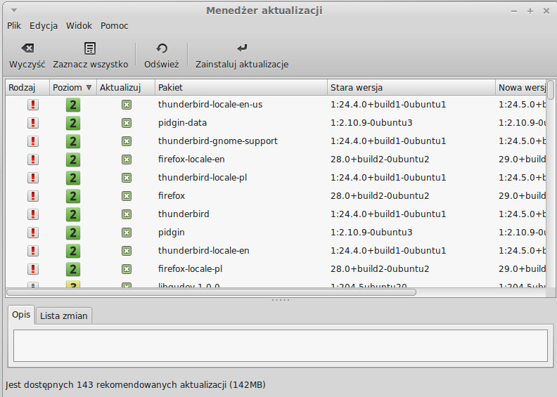
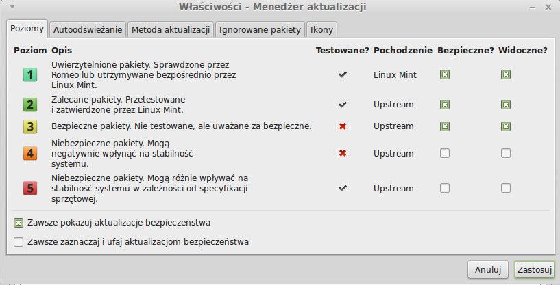
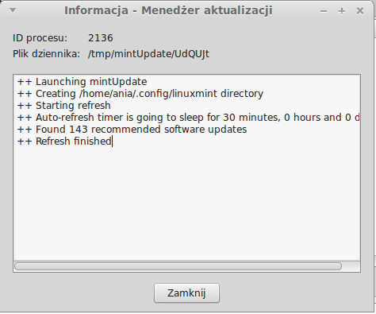
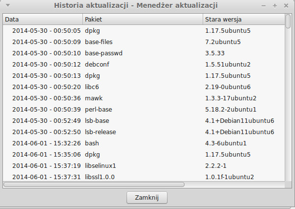

# Aktualizacja Systemu
Jeśli nowa wersja jakiegokolwiek pakietu jest dostępna, można go zaktualizować. To może być aktualizacja zabezpieczeń dla jakiegoś składnika systemu operacyjnego, aktualizacja jakiejś biblioteki czy nawet najnowsza wersja Firefox. Zasadniczo system jest zbudowany z pakietów i jakakolwiek jego część może być aktualizowana poprzez aktualizacje niektórych jego pakietów. Oznacza to zastąpienie pakietu jego nowszą wersją.

Istnieje wiele sposobów, aby to zrobić, ale tylko jeden z nich jest zalecany.

Można wykorzystać APT do aktualizacji, wykonując jedna komendę „apt-upgrade”, ale nie radzimy tego robić. Powodem jest to, że nie mamy możliwości wyboru co powinno zostać zaktualizowane, APT zakłada, że wszystko.

Niektóre części systemu bezpiecznie jest  aktualizować, a innych nie. Na przykład poprzez aktualizację jądra systemu (część, która jest odpowiedzialna między innymi za rozpoznawanie sprzętu), można popsuć obsługę dźwięku, wsparcie dla karty bezprzewodowej lub nawet niektóre aplikacje  (takie jak VMware i Virtualbox ), które są ściśle związane z jądrem.

## Menedżer Aktualizacji

Linux Mint posiada narzędzie zwane Menedżer Aktualizacji. Dostarcza on więcej informacji o aktualizacjach i pozwala określić jak bezpiecznie ta operacja może być przeprowadzona. Narzędzie to znajdziesz w prawym-dolnym rogu ekranu, ikona przypomina tarczę.

Po umieszczeniu wskaźnika myszy na ikonie, dowiesz się czy system jest aktualny, a jeśli nie to ile aktualizacji czeka.

Po kliknięciu kłódki, aplikacja otworzy się i pokaże dostępne aktualizacje. Interfejs jest bardzo prosty. Każda aktualizacja pakietu posiada opis, log zmian, ostrzeżenia lub dodatkowe informacje o aktualizacji. Możesz również dowiedzieć się, która wersja jest obecnie zainstalowana na komputerze i do jakiej wersji zostanie zaktualizowana. Wreszcie można zobaczyć poziom stabilności przypisany do aktualizacji pakietu. Każda aktualizacja pakietu przynosi poprawki lub rozwiązuje problemy z bezpieczeństwem, ale to nie znaczy, że jest  wolna od ryzyka i nie może wprowadzać nowych błędów. Poziom stabilności jest przypisany do każdego pakietu Linux Mint i mówi o tym, jak bezpieczne jest zastosować aktualizację.

Oczywiście, można kliknąć na kolumnach, aby posortować według poziomu stabilności, stanu, nazwy pakietu lub wersji. Możesz wybrać wszystkie aktualizacje lub odznaczyć je wszystkie za pomocą przycisków **Wyczyść** i **Zaznacz wszystko**.

Poziom 1 i 2 - aktualizacje są wolne od ryzyka i zawsze należy je stosować.

Poziom 3 - aktualizacje *powinny być bezpieczne*, ale, choć zaleca się je podjąć, upewnij się, że przejrzałeś ich listę. Jeśli masz problem z konkretną aktualizacją Poziomu 3, zgłoś to deweloperom Linux Mint, aby mogli podjąć środki, aby tę aktualizację przenieść na poziom 4 lub poziom 5, aby ostrzec, a nawet zniechęcić innych przed jej zastosowaniem.

Po kliknięciu na przycisk **Preferencje** powinieneś zobaczyć powyższy ekran. Domyślnie Menedżer aktualizacji informuje o aktualizacjach poziomu 1 , 2 i 3 . Możesz zdecydować czy Poziom 4 i 5 powinien być widoczny. Spowoduje to, że kolejne aktualizacje pojawią się na liście . Możesz nawet ustawić Poziom 4 i 5 jako **bezpieczny** (choć nie jest to zalecane) .

Menedżer aktualizacji zlicza się tylko **bezpieczne** aktualizacje. Tak więc, gdy mówi, że system jest na bieżąco, oznacza to, że nie istnieją dostępne aktualizacje przypisane z poziomu, który zdefiniowano jako **bezpieczny** .

Menedżer aktualizacji pokazuje tylko **widoczne** aktualizacje na liście.

Na przykład, jeśli zaznaczymy wszystkie poziomy  jako **widoczne** i tylko poziom 1 i 2 jako **bezpieczny**, będzie można zobaczyć wiele aktualizacji na liście, ale Menedżer aktualizacji poinformuje, że system jest na bieżąco .

Zakładka **Autoodświeżanie** pozwala określić, jak często aplikacja ma sprawdzać aktualizacje.

Zakładka **Metoda Aktualizacji** pozwala określić jak Menedżer Aktualizacji ma sprawdzać aktualizacje.

**Dołączaj aktualizacje, które wymagają instalacji lub usunięcia innych pakietów** - opcja pozwala określić, czy Menedżer aktualizacji powinien zainstalować nowe zależności, czy nie. Na przykład, jeśli pakiet w wersji 1 został zainstalowany na komputerze, a pakiet w wersji 2 stał się dostępny, ale w wersji 2 miał nową zależność od pakietu B, który nie jest zainstalowany na komputerze...  to co by się stało?

Jeśli odznaczysz to pole, wersja 2 nie pojawi się jako aktualizacja na liście.

Jeśli zaznaczymy to pole, to pojawi się, i pakiet B zostanie zainstalowany jako zależność.

Bądź ostrożny z tą opcją, ponieważ zależności mogą zainstalować nowe pakiety w twoim imieniu, ale mogą też czasem usunąć pakiety już zainstalowane.

W zakładce **Ignorowanie pakietów** można określić pakiety, dla których nie chcesz otrzymywać aktualizacji. Symbole **?** oraz **\*** są obsługiwane.

Ostatnia zakładka pozwala na zmianę ikony używanej przez Menedżera Aktualizacji w zasobniku systemowym.

Jeśli pojawiają się błędy  Menedżera Aktualizacji ( na przykład **Nie można odświeżyć listy pakietów**), należy sprawdzić dzienniki. Kliknij prawym przyciskiem myszy na ikonie kłódki na pasku zadań i wybierz **Informacje**. Pojawi się następujący ekran:

Na tym ekranie można zobaczyć identyfikator procesu Menedżera Aktualizacji, czy  działa z uprawnieniami administratora lub użytkownika, oraz treść jego pliku dziennika.

Możesz również przejrzeć aktualizacje, które zostały zastosowane w systemie (pod warunkiem, że zostały zainstalowane przez Menedżera Aktualizacji), klikając na `Widok -> Historia aktualizacji`.

